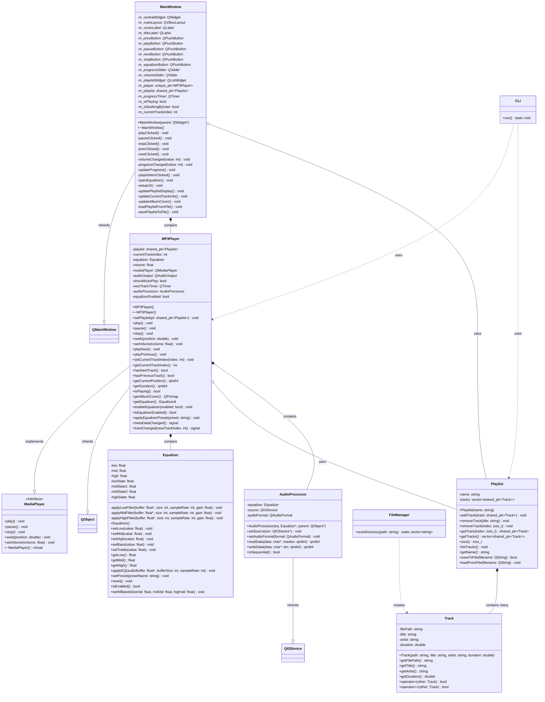

# Relatório Técnico - MP3 Player POO

**Projeto:** MP3 Player em C++ com Qt  
**Disciplina:** Programação Orientada a Objetos  
**Data:** Outubro 2025  

---

## 1. Diagrama de Classes UML (Atualizado)



## 2. Mapeamento de Conceitos POO

### 2.1 Encapsulamento

**Definição:** Ocultação de detalhes internos de implementação, expondo apenas interfaces necessárias.

| Classe | Atributos Privados | Métodos de Acesso | Localização |
|--------|-------------------|------------------|-------------|
| **Track** | `filePath`, `title`, `artist`, `duration` | `getFilePath()`, `getTitle()`, `getArtist()`, `getDuration()` | `Track.h:13-16` |
| **Playlist** | `name`, `tracks` | `getName()`, `getTracks()`, `getTrack()`, `size()` | `Playlist.h:19-20` |
| **Equalizer** | `low`, `mid`, `high`, estados dos filtros | `getLow()`, `getMid()`, `getHigh()`, `setLow()`, etc. | `Equalizer.h:18-28` |
| **MP3Player** | `playlist`, `currentTrackIndex`, `equalizer`, `volume` | `getCurrentTrackIndex()`, `getEqualizer()`, `setVolume()` | `MP3Player.h:58-67` |
| **MainWindow** | Todos os widgets (`m_playButton`, `m_progressSlider`, etc.) | Métodos públicos para interação | `MainWindow.h:46-69` |

**Justificativa:** Todos os atributos essenciais são privados, protegendo o estado interno das classes e permitindo controle sobre como os dados são acessados e modificados.

### 2.2 Herança

**Definição:** Mecanismo que permite criar novas classes baseadas em classes existentes.

| Classe Filha | Classe Pai | Tipo de Herança | Localização | Benefícios |
|-------------|------------|-----------------|-------------|------------|
| **MP3Player** | `MediaPlayer` | Interface (virtual pura) | `MP3Player.h:56` | Define contrato padrão para reprodutores |
| **MP3Player** | `QObject` | Herança múltipla | `MP3Player.h:56` | Acesso ao sistema de signals/slots do Qt |
| **MainWindow** | `QMainWindow` | Herança de framework | `MainWindow.h:24` | Funcionalidades de janela principal Qt |
| **AudioProcessor** | `QIODevice` | Herança de framework | `MP3Player.h:45` | Interface para processamento de stream de áudio |

**Implementação de Métodos Virtuais:**
```cpp
// Em MP3Player.cpp
void MP3Player::play() override { /* implementação específica para MP3 */ }
void MP3Player::pause() override { /* implementação específica */ }
void MP3Player::stop() override { /* implementação específica */ }
void MP3Player::seek(double position) override { /* implementação específica */ }
void MP3Player::setVolume(float volume) override { /* implementação específica */ }
```

### 2.3 Polimorfismo

**Definição:** Capacidade de objetos de diferentes tipos responderem à mesma interface de forma específica.

| Tipo | Implementação | Localização | Exemplo de Uso |
|------|---------------|-------------|----------------|
| **Polimorfismo de Interface** | `MediaPlayer` interface | `MediaPlayer.h:11-17` | Permite diferentes tipos de players (MP3, WAV, etc.) |
| **Polimorfismo por Herança** | Métodos virtuais Qt | `QObject`, `QMainWindow` | Override de `readData()`, `writeData()` em `AudioProcessor` |
| **Sobrecarga de Operadores** | `operator<`, `operator==` | `Track.h:27-28` | Comparação e ordenação de faixas |

**Exemplo Prático:**
```cpp
// Polimorfismo em ação
std::unique_ptr<MediaPlayer> player = std::make_unique<MP3Player>();
player->play();  // Chama MP3Player::play()
player->setVolume(0.8f);  // Chama MP3Player::setVolume()
```

### 2.4 Abstração

**Definição:** Simplificação de conceitos complexos através de interfaces bem definidas.

| Classe/Interface | Abstração Fornecida | Complexidade Oculta | Localização |
|------------------|-------------------|-------------------|-------------|
| **MediaPlayer** | Interface uniforme para reprodução | Detalhes de codecs, buffers, threads | `MediaPlayer.h:11-17` |
| **Equalizer** | Controle simples de frequências | Algoritmos de filtros digitais, DSP | `Equalizer.h:32-43` |
| **Playlist** | Gerenciamento de coleção de músicas | Estruturas de dados, persistência | `Playlist.h:22-34` |
| **FileManager** | Operações de arquivo | Sistema de arquivos, filtros | `FileManager.h:11-13` |
| **CLI** | Interface textual | Parsing de comandos, estados | `CLI.h:10-13` |

### 2.5 Composição e Agregação

**Definição:** Relacionamentos entre classes onde uma classe contém ou usa objetos de outras classes.

| Classe Container | Classe Contida | Tipo de Relacionamento | Multiplicidade | Localização |
|-----------------|----------------|----------------------|---------------|-------------|
| **MP3Player** | `Equalizer` | Composição (has-a) | 1:1 | `MP3Player.h:61` |
| **MP3Player** | `Playlist` | Agregação (uses-a) | 1:0..1 | `MP3Player.h:58` |
| **MP3Player** | `AudioProcessor` | Composição (has-a) | 1:1 | `MP3Player.h:67` |
| **Playlist** | `Track` | Composição (has-many) | 1:0..N | `Playlist.h:20` |
| **MainWindow** | `MP3Player` | Composição (has-a) | 1:1 | `MainWindow.h:70` |
| **MainWindow** | `Playlist` | Agregação (uses-a) | 1:0..1 | `MainWindow.h:71` |

**Exemplo de Composição:**
```cpp
class MP3Player {
private:
    Equalizer equalizer;  // Composição: equalizer é parte integral do player
    std::shared_ptr<Playlist> playlist;  // Agregação: playlist pode existir independentemente
};
```

### 2.6 Design Patterns Identificados

| Pattern | Implementação | Localização | Benefício |
|---------|---------------|-------------|-----------|
| **Strategy** | Interface `MediaPlayer` | `MediaPlayer.h` | Diferentes algoritmos de reprodução |
| **Observer** | Qt Signals/Slots | `MP3Player.h:73-74` | Notificação de mudanças de estado |
| **Facade** | Classes `CLI` e `MainWindow` | `CLI.h`, `MainWindow.h` | Interface simplificada para subsistema complexo |
| **Composite** | `Playlist` contendo `Track` | `Playlist.h:20` | Estrutura hierárquica de objetos |

## 3. Análise de Qualidade POO

### 3.1 Princípios SOLID Aplicados

| Princípio | Aplicação | Exemplo |
|-----------|-----------|---------|
| **Single Responsibility** | Cada classe tem uma responsabilidade específica | `Track` (dados da música), `Equalizer` (processamento de áudio) |
| **Open/Closed** | `MediaPlayer` interface permite extensão sem modificação | Novos tipos de player podem ser adicionados |
| **Liskov Substitution** | `MP3Player` pode substituir `MediaPlayer` em qualquer contexto | Polimorfismo de interface |
| **Interface Segregation** | Interfaces específicas e focadas | `MediaPlayer` contém apenas métodos essenciais |
| **Dependency Inversion** | Dependência de abstrações, não implementações | `MP3Player` depende da interface `MediaPlayer` |

### 3.2 Métricas de Complexidade

| Métrica | Valor | Avaliação |
|---------|-------|-----------|
| **Profundidade de Herança** | 2 níveis | Adequada |
| **Acoplamento** | Baixo a Médio | Uso de interfaces e shared_ptr |
| **Coesão** | Alta | Classes com responsabilidades bem definidas |
| **Número de Classes** | 8 principais | Tamanho gerenciável |

## 4. Conclusões

### 4.1 Pontos Fortes da Implementação

1. **Arquitetura bem estruturada** com separação clara de responsabilidades
2. **Uso adequado de herança** com interface `MediaPlayer`
3. **Encapsulamento efetivo** em todas as classes principais
4. **Polimorfismo aplicado** através de interfaces e métodos virtuais
5. **Composição e agregação** bem implementadas
6. **Padrões de design** aplicados adequadamente

### 4.2 Conceitos POO Demonstrados

✅ **Encapsulamento**: Atributos privados com interfaces controladas  
✅ **Herança**: Interface `MediaPlayer` e herança Qt  
✅ **Polimorfismo**: Métodos virtuais e sobrecarga de operadores  
✅ **Abstração**: Interfaces simples ocultando complexidade  
✅ **Composição**: Relacionamentos has-a e uses-a bem definidos  

### 4.3 Conformidade com Boas Práticas

- **RAII** (Resource Acquisition Is Initialization) com smart pointers
- **Const-correctness** em métodos de acesso
- **Interface segregation** com classes focadas
- **Dependency injection** através de shared_ptr
- **Exception safety** com RAII

Esta implementação demonstra uma aplicação sólida e bem estruturada dos conceitos fundamentais de Programação Orientada a Objetos, adequada para um projeto final de disciplina de POO.

---

**Documento gerado em:** Outubro 2025  
**Versão:** 1.0  
**Projeto:** MP3 Player - Programação Orientada a Objetos